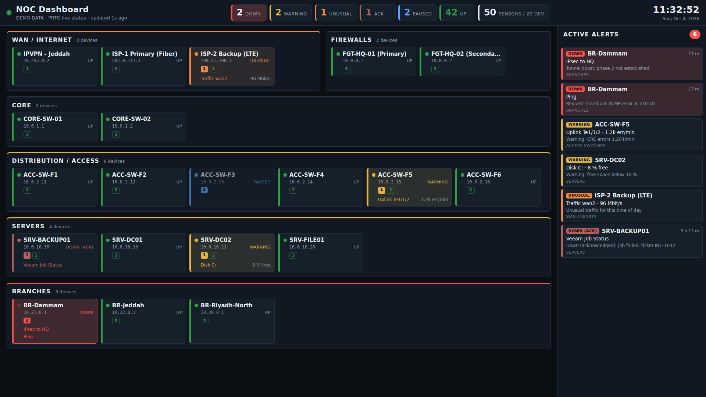

# PRTG NOC Dashboard

A wall-screen status page that pulls live data from the PRTG API. It replaces the
Map Designer map (`mapshow.htm?id=3162`).



- **Layout by tier** (WAN → Firewalls → Core → Access → Servers → Branches),
  set in `public/config.js`. New PRTG devices show up automatically.
- **Summary bar:** Down / Warning / Unusual / Ack / Paused / Up counts. Down pulses red.
- **Alert panel:** sorted by severity, then PRTG priority. New alerts flash.
- **Stale-data protection:** if PRTG can't be reached, a banner says so and the
  screen turns grey. It never shows an old green screen as if it were live.
- **No PRTG sensors used:** reading the API costs no sensors (relevant with a 100-sensor license).
- **No npm dependencies:** needs only Node.js 18 or newer.

## How it works

```
NOC screen (browser) ──HTTP──► noc-dashboard (Node, :8080) ──HTTPS + API key──► PRTG /api/table.json
                                │ caches for 15 s, one query no matter how many screens are open
                                └ the API key stays on this box and never reaches the browser
```

The backend only ever runs two fixed read-only queries (`content=devices`,
`content=sensors`). The browser can't use it as a general proxy to PRTG.

## Setup

1. **Create a read-only PRTG user** with read access to the groups that should appear.
   Then create an API key for that user with read-only access.
2. **Choose a host** that can reach PRTG on 443. This can be the PRTG server itself
   or a small VM. Install Node.js 18 LTS or newer.
3. Copy this folder to the host, then copy `.env.example` to `.env` and fill in
   `PRTG_URL` and `PRTG_APITOKEN`.
4. Run `node server.js` and open `http://<host>:8080/`.
5. Use `http://<host>:8080/?demo=1` to see the layout with sample data.

### Run as a service

- **Linux:** see `deploy/noc-dashboard.service`.
- **Windows:** use NSSM (`nssm install NOC-Dashboard "C:\Program Files\nodejs\node.exe" C:\noc-dashboard\server.js`,
  then set the AppDirectory to `C:\noc-dashboard`), or a Scheduled Task that runs at startup.

### Wall screen

Run Chrome or Edge in kiosk mode:

```
msedge.exe --kiosk "http://<host>:8080/?kiosk=1" --edge-kiosk-type=fullscreen
chrome.exe --kiosk "http://<host>:8080/?kiosk=1"
```

`?kiosk=1` hides the cursor. If the devices don't fit on one screen, it also
scrolls the device area slowly from top to bottom and back.

## Configuration

**`public/config.js`** controls the layout:

| Setting | Purpose |
|---|---|
| `sections` | Tier order and matching rules. A device goes into the first section it matches, by PRTG tag (`noc-fw`), group name regex, or device name regex. |
| `unmatched` | `'group'`: devices that match no section are grouped by their PRTG group. `'other'`: they all go into one "Other" section. |
| `excludeGroups` | Regex list of PRTG groups to hide (labs, tests). |
| `sortDevices` | `'name'` keeps tiles in fixed positions, which is what you want on a wall screen. `'severity'` moves problems to the front. |
| `refreshSeconds` / `staleAfterSeconds` | How often the screen polls, and how long until the data counts as stale. |

The most reliable way to place devices is with tags. Add `noc-wan`, `noc-fw`, `noc-core`,
`noc-access`, `noc-server` or `noc-branch` to devices (or their parent groups) in PRTG.

**`.env`** holds the backend settings: PRTG URL and credentials, TLS settings,
port, cache time, and an optional basic-auth login. See `.env.example`.

## Security

- Use a **read-only** PRTG account. The dashboard never needs write access.
- `chmod 600 .env` (Linux), or restrict the file ACL to the service account (Windows).
- Prefer `PRTG_CA_FILE` (your internal CA in PEM format) over `PRTG_INSECURE_TLS=1`.
- Limit TCP/8080 to the NOC and management subnets on the host firewall, or set
  `DASH_USER`/`DASH_PASS`. The page shows device names and IPs.
- The page uses no external CDNs or fonts, so it works on isolated networks.
  It sends a strict CSP and `nosniff`/`SAMEORIGIN` headers.

## Troubleshooting

| What you see | Cause |
|---|---|
| `PRTG rejected credentials (HTTP 401)` | Wrong or expired API key, or the user is disabled. |
| `PRTG returned non-JSON response` | Wrong `PRTG_URL` (a login page came back), or the request hit a reverse proxy. |
| `request failed: self-signed certificate` / `unable to verify` | Set `PRTG_CA_FILE`. |
| Page loads but no devices | The API user has no read access to the groups. Check the access rights on the groups/probe. |
| `GET /healthz` | Liveness check. Returns `{"ok":true,"prtgConfigured":true}`. |

`deploy/test-prtg-api.ps1` checks the API key from Windows and lists your groups.
